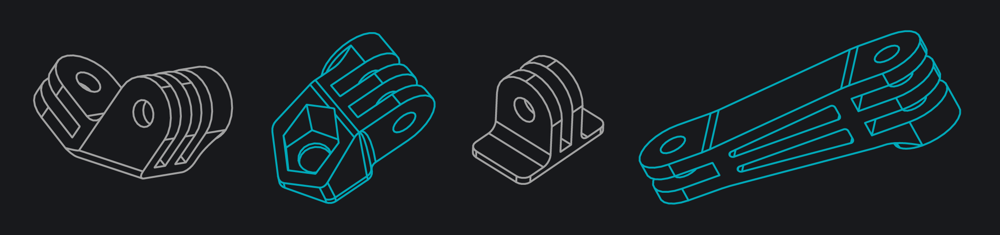

# Modular Mounts

3D printable GoPro-compatible mounting accessories for cameras, phones, and more

### 3D Printing Notes
STL files for all parts can be found in the `stls` folder. The original Solidworks design files can be found in the [GrabCAD folder for this project](https://workbench.grabcad.com/workbench/projects/gcnUv4yWleEZdF-MvPbkRW6ztajOTvjOf2FrRhKy1aaAlx#/space/gcRLR5dOVLxat1oCPV2CXJvUbPfd5Zgm9qYSkP6tpdQevQ). All parts should be printed at 100% infill with 3 or more perimeters.

## Parts

### GoPro Tripod Mounts

For attaching GoPro compatible mounts to a standard 1/4-20 screw mount

### GoPro Straight Link

50mm long straight mount extension

### GoPro Direction Changers

For making a mount that rotates around multiple axes

### GoPro Flat Mounts

For use with VHB tape, Velcro, Dual Lock, etc

### GoPro Male Tripod Screw Adapter

For attaching a device with a 1/4-20 threaded hole to GoPro compatible mounts

### GoPro Tube Mounts

**Coming Soon.**

For clamping GoPro compatible mounts to round tubes or rods

### Phone Mount

**Coming Soon.**

For attaching a smartphone or similarly sized device to GoPro compatible mounts

### Arca Quick Release Mount

**Coming Soon.**

For using GoPro compatible mounts with an Arca-Swiss style quick release tripod head

## License
This work is licensed under a [Creative Commons Attribution-ShareAlike 4.0 International License](http://creativecommons.org/licenses/by-sa/4.0/).

#### Disclaimer
<small>These CAD models are not affiliated with, endorsed by or in any way associated with GoPro Inc. or its products and services. GoPro, HERO, Session, Karma and their respective logos are trademarks or registered trademarks of GoPro, Inc.</small>
